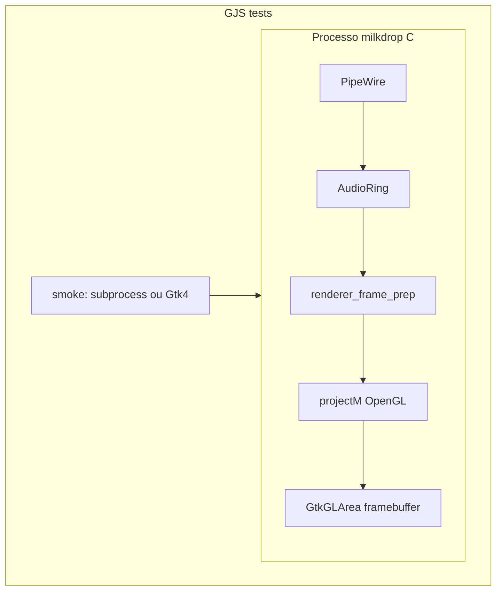

# Plano: testes do pipeline de render (C + GJS, incl. projectM → GTK4)

## Arquitetura do “frame” (para alinhar expectativas)

No binário **C** [`src/main.c`](src/main.c), o projectM **não copia** um buffer de imagem para o GTK em CPU. O fluxo é:

1. `GtkGLArea` cria um contexto OpenGL (3.3 core).
2. No sinal `render`, o código chama `gtk_gl_area_make_current` (implícito no handler) e depois `projectm_opengl_render_frame`, que desenha **direto** no framebuffer ligado à área GL da janela.
3. O GTK/Mutter compõe essa superfície como qualquer outra janela Wayland/X11.

Ou seja: “transferência de frames” aqui = **uma cadeia OpenGL + apresentação da superfície GTK**, não um `memcpy` de textura. Evidência forte de que isso funciona exige, na prática, **readback GL ou apresentação visível**, o que o **GJS puro** não faz bem (sem bindings estáveis para epoxy/OpenGL).

**Papel do GJS neste plano:** orquestrar testes que **incluem** essa etapa (via subprocesso C ou via ciclo de sinais GTK4), sem duplicar o render do projectM em JavaScript.

## Parte 1 — Testes C pequenos (entrada/saída, sem display)

(igual à iteração anterior do plano, mantida.)

- Extrair **`renderer_frame_prep`** em [`src/renderer.c`](src/renderer.c) / [`src/renderer.h`](src/renderer.h) com struct de saída (`floats_copied`, `stereo_frames`, `would_feed_pcm`, `would_draw`, etc.) e refatorar `on_render` em [`src/main.c`](src/main.c) para usar a mesma função.
- Extrair **`audio_align_stereo_float_count`** em [`src/audio.c`](src/audio.c) para o alinhamento estéreo do PipeWire; testes numéricos.
- Novo binário **`test-render-pipeline`** em [`tests/test_render_pipeline.c`](tests/test_render_pipeline.c), registrado em [`tests/meson.build`](tests/meson.build).
- Alinhar **`c_args` / HAVE_PROJECTM** entre [`src/meson.build`](src/meson.build) e o executável de teste (variáveis Meson partilhadas).

## Parte 2 — GJS: cobrir o caminho até a janela GTK4 + projectM

### 2a) Smoke C mínimo “um frame + evidência GL” (invocado pelo GJS)

Adicionar um alvo de teste **C** pequeno (preferência: executável separado `test-milkdrop-gtk-frame` em `tests/`, **ou** flag `--smoke-one-frame` no `milkdrop` se quiserem um único binário) que:

1. Inicia `GtkApplication` + janela + `GtkGLArea` (espelhando requisitos GL 3.3 como em [`main.c`](src/main.c)).
2. Em `realize`, inicializa projectM como hoje (só quando `HAVE_PROJECTM`).
3. No primeiro `render` válido (após resize com dimensões > 0): chama `projectm_opengl_render_frame`, depois **`glReadPixels`** (ou leitura de um canto pequeno) para verificar que o buffer **não** é uniforme “vazio” de forma trivial (ex.: variância > limiar ou não todos zeros — ajustar para evitar flakiness).
4. Imprime **uma linha JSON** em stdout, ex.: `{"stage":"projectm_to_gtk_glarea","ok":true}` e sai com código 0.

**Meson:** compilar só com `have_projectm`; registrar teste com `env: ['DISPLAY', ...]` ou **`xvfb-run -a`** quando disponível, ou marcar como `suite: 'gpu'` / skip se sem display (padrão documentado no comentário do `meson.build`).

### 2b) Harness GJS que orquestra o smoke

Novo script, por exemplo [`tests/pipeline_gtk_smoke.gjs`](tests/pipeline_gtk_smoke.gjs), invocado por Meson com `gjs` (e `find_program('gjs')`):

- Resolve o caminho do executável de smoke (argumento passado pelo Meson: `meson.current_build_dir()` + nome do binário).
- Usa **`Gio.Subprocess`** / `SubprocessLauncher` para executar o binário com timeout (ex. 15–30 s).
- Valida **exit code** e **stdout** contendo o JSON esperado (parse simples ou `prefix` estável).
- Falha com mensagem clara por estágio (`spawn failed`, `timeout`, `gl readback failed`, etc.).

Assim o **GJS “inclui”** explicitamente a etapa **projectM → framebuffer do GtkGLArea → evidência de pixel**, sem fingir que o projectM roda dentro do interpretador JS.

### 2c) (Opcional, só GJS + Gtk4, sem projectM) Contagem de sinais GLArea

Um segundo script GJS opcional pode criar `GtkWindow` + `GtkGLArea`, conectar `realize` / `resize` / `render`, fazer `gtk_gl_area_queue_render` e sair após **N** callbacks `render` — prova que a **pilha GTK4 + GL** dispara, útil quando o smoke C com projectM está desativado (CI sem GPU). Não substitui 2a; complementa diagnóstico (“GTK quebrou antes do projectM?”).

## Parte 3 — O que não entra neste plano

- Testes que rodam **dentro do GNOME Shell** (`Meta`, `Extension`) — exigem sessão Shell; manter separados dos testes `meson test` padrão, salvo o fluxo já existente de integração aninhada.
- Reimplementar projectM em GJS ou bindings GI para libprojectM — fora de escopo e frágil.

## Critérios de sucesso

- `meson test -C build` roda: unitários C do prep + (quando configurado) smoke **C** de um frame; o alvo GJS falha/pass de forma determinística conforme ambiente.
- Documentação curta em comentário no `meson.build` ou no script GJS: como rodar smoke com display real vs `xvfb-run`.
- Em caso de regressão, dá para ver se falhou no **prep C**, no **smoke GL+projectM**, ou apenas no **harness GJS** (spawn/parse).

## Tarefas (checklist)

- [ ] Expor `have_projectm` / `c_args` do renderer para `tests/meson.build`.
- [ ] `renderer_frame_prep` + refatorar `on_render` em `main.c`.
- [ ] `audio_align_stereo_float_count` + testes.
- [ ] `test-render-pipeline` (C).
- [ ] Binário ou flag C **smoke** projectM + `glReadPixels` + JSON stdout.
- [ ] `pipeline_gtk_smoke.gjs` + entrada Meson (`gjs`, path do binário, timeout).
- [ ] (Opcional) GJS só Gtk4 contagem de `render`.
